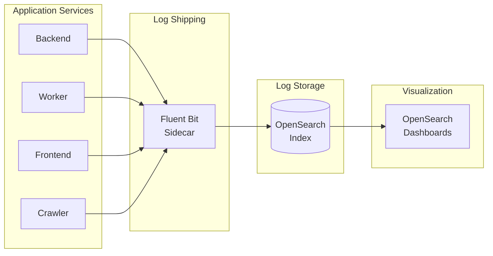
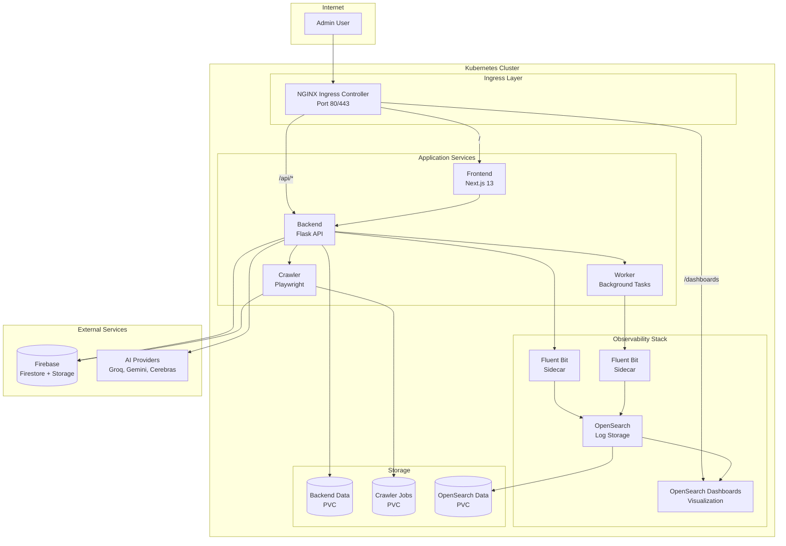
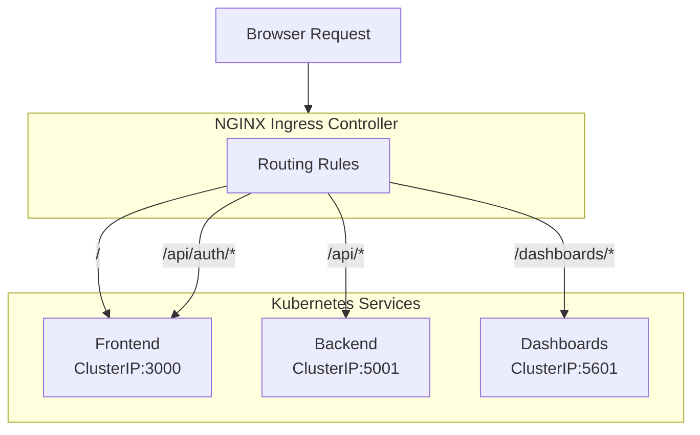
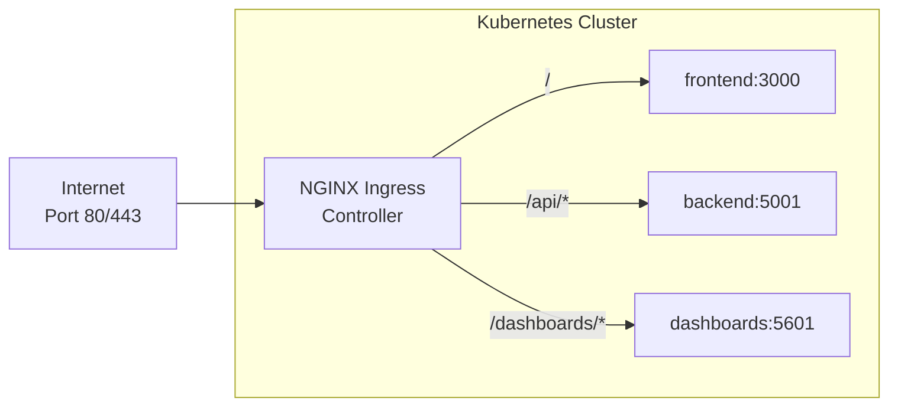
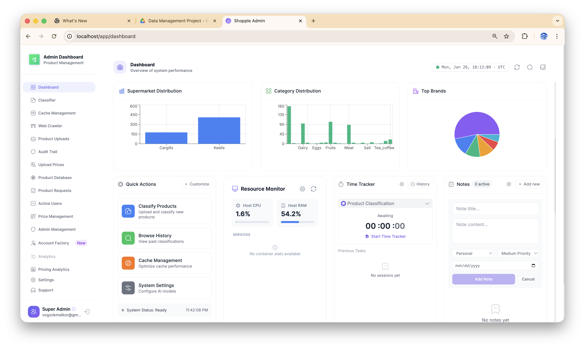
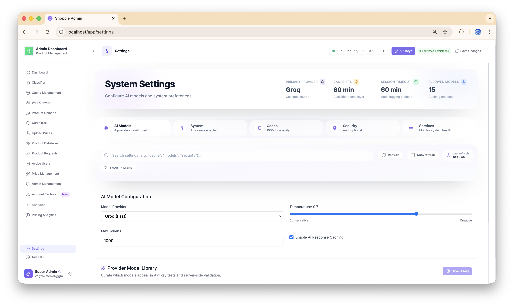
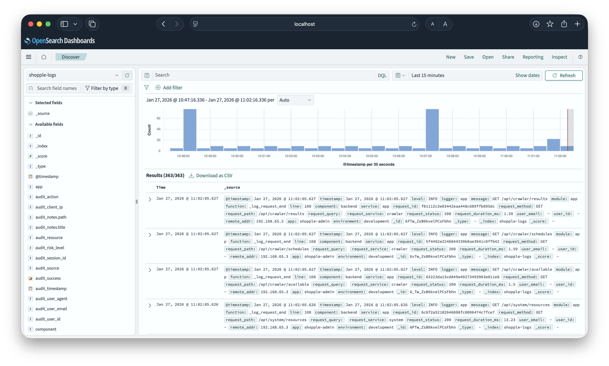

# Shopple Admin

<div align="center">
  
  
  **Enterprise Product Catalog Management Platform**
  
  [](https://kubernetes.io/)
  [](https://docker.com/)
  [](https://opensearch.org/)
  [](https://nextjs.org/)
  [](https://flask.palletsprojects.com/)
</div>

---

**Shopple Admin** is a production-ready administrative platform for managing grocery product catalogs at scale. Built with a modern microservices architecture, it provides AI-powered product classification, automated web crawling for price monitoring, intelligent duplicate detection, and comprehensive observability—all deployable with a single command.

This platform serves as the backend for [Shopple](https://github.com/FouetteBytes/shopple-app), a Flutter mobile application that helps users find the **minimum price** for grocery items across participating Sri Lankan supermarkets (Cargills, Keells).

---

## Table of Contents

- [What This Project Does](#what-this-project-does)
- [Key Capabilities](#key-capabilities)
- [Infrastructure Highlights](#infrastructure-highlights)
- [Architecture](#architecture)
- [Kubernetes Cluster](#kubernetes-cluster)
- [Technology Stack](#technology-stack)
- [Getting Started](#getting-started)
- [Deployment Options](#deployment-options)
- [Screenshots](#screenshots)
- [Related Projects](#related-projects)

---

## What This Project Does

Shopple Admin solves the complex challenge of **managing a multi-source grocery product catalog** with:

### Product Catalog Management
- **Ingest products** from multiple supermarket chains (Keells, Cargills)
- **Normalize product data** with consistent naming, sizing, and categorization
- **Track prices** across stores with historical analytics
- **Manage 10,000+ products** with sub-50ms search response times

### AI-Powered Classification
- **Automatic categorization** using multi-model AI cascade
- **Intelligent fallbacks**: Groq → Gemini → Cerebras → OpenRouter
- **Batch processing** with confidence scoring and manual override
- **Classification history** with replay and audit capabilities

### Automated Web Crawling
- **Scheduled price scraping** from supermarket websites
- **Headless browser automation** with Playwright
- **Real-time progress streaming** via Server-Sent Events
- **Automatic image uploads** to Firebase Storage

### Intelligent Duplicate Detection
- **Weighted scoring algorithm** analyzing name, brand, tokens, and size
- **Preview/confirm workflow** for admin review
- **Granular actions**: Keep existing, update image only, or create new

### Real-Time Monitoring and Logging
- **Centralized logging** with Fluent Bit → OpenSearch pipeline
- **Pre-configured dashboards** for log visualization
- **Service health monitoring** with CPU/memory metrics
- **Slack notifications** for critical alerts

---

## Key Capabilities

| Capability | Description |
|------------|-------------|
| **One-Command Deployment** | Deploy entire stack with `bash k8s/scripts/start.sh` |
| **Production-Ready K8s** | Full Kubernetes manifests with NGINX Ingress, RBAC, PVCs |
| **Centralized Logging** | Fluent Bit sidecars ship structured JSON logs to OpenSearch |
| **Searchable Log Dashboards** | OpenSearch Dashboards with pre-built visualizations |
| **Multi-Model AI** | Automatic failover between 4 AI providers |
| **Real-Time Updates** | SSE streaming for crawler progress and classification |
| **Secure Secrets** | Fernet encryption for API keys, K8s secrets management |
| **Auto-Indexing** | Products automatically synced to OpenSearch on CRUD |

---

## Infrastructure Highlights

### Easy Deployment

This project is designed for **zero-friction deployment**. Everything is containerized and orchestrated:

```bash
# Clone and deploy in minutes
git clone https://github.com/FouetteBytes/shopple-admin.git
cd shopple-admin
cp .env.example .env  # Add your Firebase credentials
bash k8s/scripts/start.sh
```

The script performs the following steps:
1. Builds all Docker images (backend, frontend, crawler, worker)
2. Creates Kubernetes secrets from your `.env` file
3. Deploys all manifests (10 YAML files)
4. Sets up NGINX Ingress Controller
5. Configures OpenSearch with dashboards

### Log Management with OpenSearch

All services emit structured JSON logs that flow through a centralized pipeline:



**Log Features:**
- Structured JSON format with request ID, user ID, duration
- Component tagging (backend, worker, frontend, crawler)
- Query logs by service, endpoint, status code, or time range
- Pre-built dashboards for request analytics and error tracking

Access logs at: `http://localhost/dashboards`

---

## Architecture

### High-Level System Diagram



### Request Flow



**Routing Rules:**
| Path | Destination | Description |
|------|-------------|-------------|
| `/` | Frontend (3000) | Admin dashboard UI |
| `/api/*` | Backend (5001) | REST API endpoints |
| `/api/auth/*` | Frontend (3000) | Next.js auth routes |
| `/dashboards/*` | Dashboards (5601) | Log visualization |

---

## Kubernetes Cluster

### Cluster Components

The Kubernetes deployment consists of 10 manifest files that define the complete infrastructure:

| Manifest | Purpose |
|----------|---------|
| `00-storage.yaml` | PersistentVolumeClaims for data persistence |
| `01-opensearch.yaml` | OpenSearch StatefulSet for log storage and product search |
| `02-dashboards.yaml` | OpenSearch Dashboards for log visualization |
| `03-backend.yaml` | Flask API with Fluent Bit sidecar |
| `04-frontend.yaml` | Next.js dashboard with Fluent Bit sidecar |
| `05-crawler.yaml` | Playwright-based web scraper |
| `06-worker.yaml` | Background task processor with Fluent Bit sidecar |
| `07-fluentbit-config.yaml` | ConfigMap for Fluent Bit log shipping |
| `08-ingress.yaml` | NGINX Ingress for unified routing |
| `09-rbac.yaml` | ServiceAccount and RBAC for K8s API access |

### Services Overview

| Service | Type | Port | Description |
|---------|------|------|-------------|
| `frontend` | ClusterIP | 3000 | Next.js admin dashboard |
| `backend` | ClusterIP | 5001 | Flask REST API |
| `opensearch` | ClusterIP | 9200 | Search engine and log storage |
| `opensearch-dashboards` | ClusterIP | 5601 | Log visualization UI |
| `crawler` | ClusterIP | - | No exposed port (job-based) |
| `worker` | ClusterIP | - | No exposed port (queue-based) |

### NGINX Ingress Controller

A single NGINX Ingress Controller handles all external traffic:



**Benefits:**
- Single LoadBalancer instead of one per service
- Unified SSL/TLS termination
- Path-based routing with regex support
- WebSocket and SSE support for real-time features

### Persistent Storage

Data persists across pod restarts using PersistentVolumeClaims:

| PVC | Size | Purpose |
|-----|------|---------|
| `backend-data` | 1Gi | API keys, classification cache |
| `crawler-jobs` | 2Gi | Job definitions and schedules |
| `crawler-logs` | 2Gi | Crawler execution logs |
| `crawler-output` | 5Gi | Scraped product data |
| `opensearch-data` | 10Gi | Logs and search indices |

### Fluent Bit Log Shipping

Each application pod includes a Fluent Bit sidecar container:

```yaml
# Example: Backend Pod
containers:
- name: backend
  image: shopple-backend:latest
  volumeMounts:
  - name: logs-volume
    mountPath: /app/backend/logs

- name: fluent-bit          # Sidecar
  image: fluent/fluent-bit:latest
  volumeMounts:
  - name: logs-volume
    mountPath: /app/backend/logs
  - name: fluent-bit-config
    mountPath: /fluent-bit/etc/
```

**Log Format:**
```json
{
  "@timestamp": "2026-01-27T05:35:46.604Z",
  "level": "INFO",
  "logger": "app",
  "message": "GET /api/products/search",
  "component": "backend",
  "request_id": "4a8f4c2a-d80e-4527-85f1-5ec3a56ba8f6",
  "request_method": "GET",
  "request_path": "/api/products/search",
  "request_status": 200,
  "request_duration_ms": 32.5
}
```

---

## Technology Stack

### Frontend
| Technology | Purpose |
|------------|---------|
| Next.js 13 | React framework with App Router |
| TypeScript | Type-safe development |
| Tailwind CSS | Utility-first styling |
| SWR | Data fetching with caching |
| Zustand | Lightweight state management |
| Firebase Auth | Admin authentication |

### Backend
| Technology | Purpose |
|------------|---------|
| Python 3.11 | Runtime environment |
| Flask | REST API framework |
| Gunicorn | Production WSGI server |
| Pydantic | Request/response validation |
| OpenSearch Python | Search and indexing |
| Firebase Admin | Firestore and Storage |

### AI Providers
| Provider | Model | Use Case |
|----------|-------|----------|
| Groq | Llama 3.3 70B | Primary classification |
| Google Gemini | Gemini 2.0 Flash | Complex products |
| Cerebras | Llama 3.3 70B | Batch processing |
| OpenRouter | Multiple | Fallback cascade |

### Infrastructure
| Technology | Purpose |
|------------|---------|
| Kubernetes | Container orchestration |
| Docker | Containerization |
| NGINX Ingress | Traffic routing |
| OpenSearch | Search and log storage |
| Fluent Bit | Log shipping |
| Firebase | Database and storage |

---

## Getting Started

### Prerequisites

- **Docker Desktop** (4.0+) with Kubernetes enabled
- **Git** for cloning
- **8GB RAM** minimum (OpenSearch requirement)
- **Firebase Project** with Firestore and Storage

### Quick Start (5 Minutes)

```bash
# 1. Clone repository
git clone https://github.com/FouetteBytes/shopple-admin.git
cd shopple-admin

# 2. Configure environment
cp .env.example .env
# Edit .env with your Firebase credentials

# 3. Deploy to Kubernetes
bash k8s/scripts/start.sh

# 4. Access services
open http://localhost           # Dashboard
open http://localhost/dashboards  # Logs
```

### Environment Configuration

Create `.env` with these required variables:

```env
# Firebase (required)
FIREBASE_PROJECT_ID=your-project-id
FIREBASE_CLIENT_EMAIL=your-service-account@...
FIREBASE_PRIVATE_KEY=your-private-key

# Security (required)
KEYSTORE_SECRET=<generate with: openssl rand -base64 32>
SECRET_KEY=<generate with: python -c "import secrets; print(secrets.token_hex(32))">

# Firebase Client (required for frontend)
NEXT_PUBLIC_FIREBASE_API_KEY=AIza...
NEXT_PUBLIC_FIREBASE_AUTH_DOMAIN=your-project.firebaseapp.com
NEXT_PUBLIC_FIREBASE_PROJECT_ID=your-project-id
NEXT_PUBLIC_FIREBASE_STORAGE_BUCKET=your-project.appspot.com
NEXT_PUBLIC_FIREBASE_MESSAGING_SENDER_ID=123456789
NEXT_PUBLIC_FIREBASE_APP_ID=1:123456789:web:abc123
```

---

## Deployment Options

### Option 1: Kubernetes (Recommended)

Full production deployment with all features:

```bash
# Full deployment (builds images, deploys all services)
bash k8s/scripts/start.sh

# Quick restart (no rebuild)
bash k8s/scripts/start.sh --quick

# Build with cache (faster)
bash k8s/scripts/start.sh --with-cache

# Stop cluster (preserves data)
bash k8s/scripts/stop.sh

# Clean everything
bash k8s/scripts/clean.sh --purge-all
```

### Option 2: Docker Compose (Simpler)

Single-host deployment without Kubernetes:

```bash
# Development
docker-compose up --build

# Production (pre-built images)
docker-compose -f docker-compose.release.yml up -d
```

### Accessing Services

| Service | URL | Purpose |
|---------|-----|---------|
| Dashboard | http://localhost | Admin interface |
| API | http://localhost/api | REST endpoints |
| Logs | http://localhost/dashboards | OpenSearch Dashboards |
| Health | http://localhost/api/health | Service status |

---

## Screenshots

<div align="center">

| **Dashboard** | **Products** |
|:---:|:---:|
|  |  |

| **AI Classification** | **Web Crawler** |
|:---:|:---:|
|  |  |

| **Settings** | **Log Viewer** |
|:---:|:---:|
|  |  |

</div>

---

## Repository Layout

```
shopple-admin/
├── assets/                     # Logo and screenshots
│   ├── icon/
│   └── screenshots/
├── backend/                    # Flask API
│   ├── features/               # Domain modules (products, prices, users)
│   ├── services/               # Core services
│   │   ├── ai_handlers/        # Groq, Gemini, Cerebras, OpenRouter
│   │   ├── firebase/           # Firestore client
│   │   └── products/           # OpenSearch integration
│   └── tests/                  # Unit and integration tests
├── crawler/                    # Web scraper
│   ├── keells/                 # Keells Super crawler
│   └── cargills/               # Cargills crawler
├── frontend/                   # Next.js dashboard
│   └── src/
│       ├── app/                # App Router pages
│       └── components/         # React components
├── k8s/                        # Kubernetes manifests
│   ├── 00-storage.yaml         # PersistentVolumeClaims
│   ├── 01-opensearch.yaml      # Search and log storage
│   ├── 02-dashboards.yaml      # Log visualization
│   ├── 03-backend.yaml         # Flask API + Fluent Bit
│   ├── 04-frontend.yaml        # Next.js + Fluent Bit
│   ├── 05-crawler.yaml         # Playwright scraper
│   ├── 06-worker.yaml          # Background processor
│   ├── 07-fluentbit-config.yaml # Log shipping config
│   ├── 08-ingress.yaml         # NGINX routing
│   ├── 09-rbac.yaml            # ServiceAccount and RBAC
│   └── scripts/                # start.sh, stop.sh, clean.sh
├── docker-compose.yml          # Local development
├── docker-compose.release.yml  # Production deployment
└── .env.example                # Configuration template
```

---

## Related Projects

| Project | Description |
|---------|-------------|
| [Shopple App](https://github.com/FouetteBytes/shopple-app-public.git) | Flutter mobile app for grocery price comparison |

---


